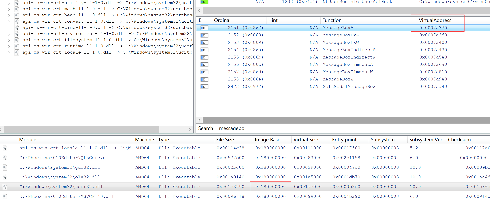
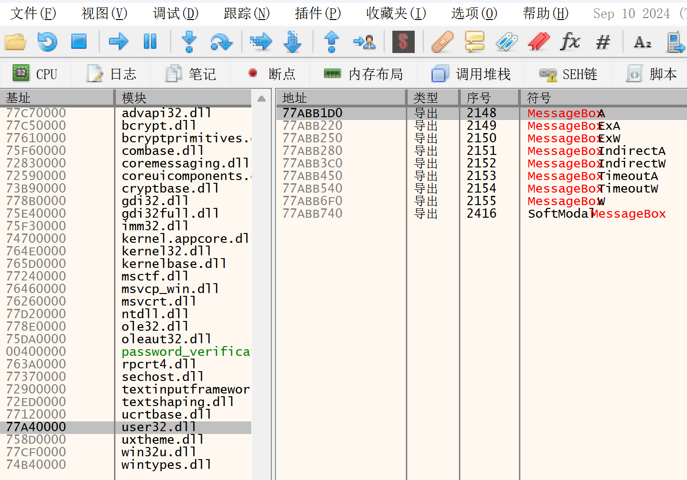
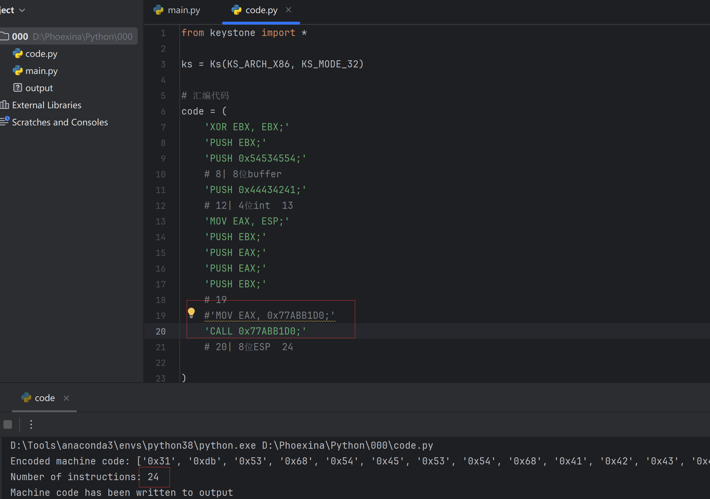
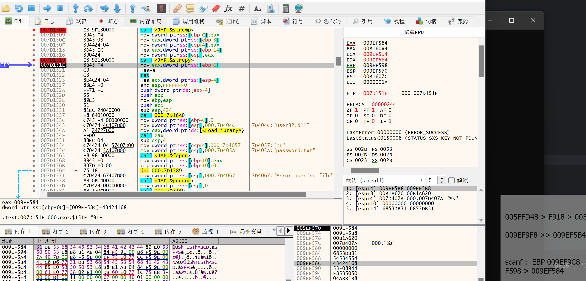
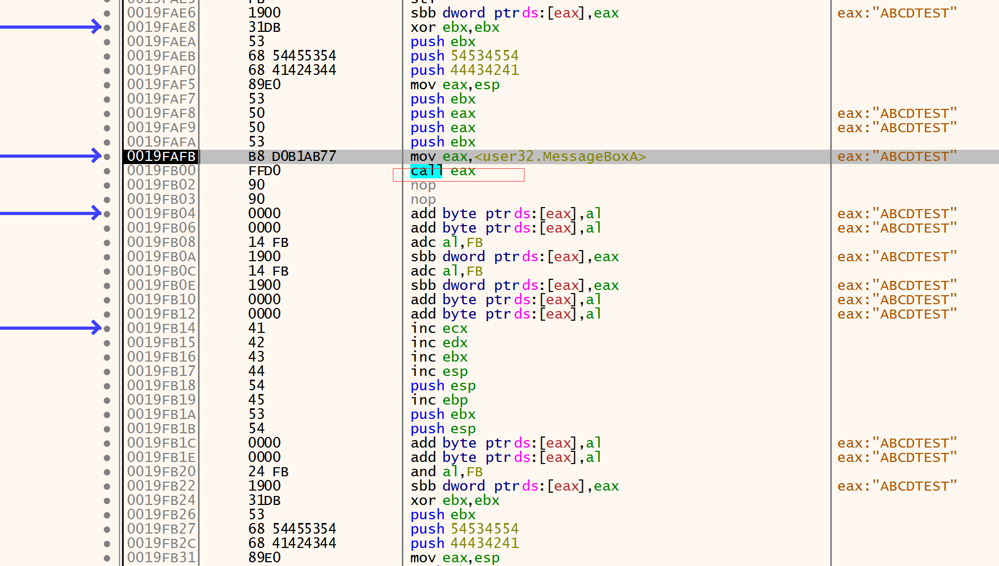
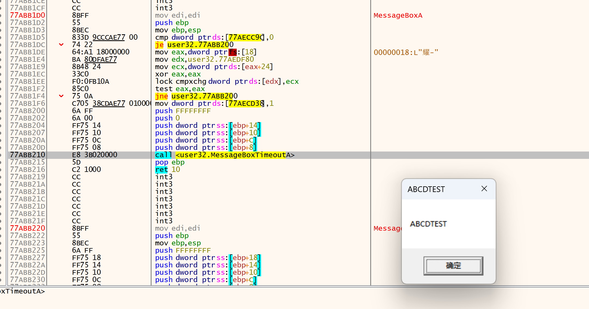

# 栈溢出：汇编代码植入练习

---

> 书中使用的环境是低版本的，为更好理解，本次在win11进行复现
> 
> xdbg32 | vs2022buildtool | (Clion + mingw-i636)
> 
> 最初我是Clion直接编译，此前的练习 ”溢出使错误密码也输出正确“ 和 ”覆盖跳转直接返回到成功“ 均可以正常，但这个练习中在DEP上遇到问题

### 1 ASLR

##### 1.1 dll加载基址不对

按照书中的说法可以在这里直接用基址+偏移量，但看起来这个基址不太对劲。



通过0X77A40000+0X0867=77ABB1D0，期间我的机器没有重启，这个地址一直没有变化。

（大概搜索了一下这个是ASLR导致的？）

##### 1.2 函数中的Buffer地址一直在变化

函数之间的偏移量是固定的，这个可以在输入前断点，看调用输入函数前的EBP，再去看对应的buffer起始位置

此时是Clion编译的，buffer8+int4+ebp8+ret8（书上的两个指针都是4）。由于汇编指令可以压缩到24位（省略了mov+call，但是这样写后面反汇编看起来不太对），我还在使用buffer[8]。（后面会知道这个确实要扩展很大，不然会被覆盖）


下图此时调用输入的EBP是 009EF9C8，经过计算需要-0x430-0x14，最后得到 009EF584


验证发现确实可以，此时strcpy后确实复制过来了


但是这里又遇到了问题，走到这里反复报错不能继续了，如下图。

经过查询可能和DEP数据执行保护有关。


Clion不能用了，因为mingw不支持关闭dep的选项，只好转战vs2022buildtool

### 2 DEP + Stack Guard

##### 2.1 cl编译

之后使用cl以下命令编译的exe调试，Buffer地址也不会变了。

```shell
cl /Od /Zi /GS- /Fe:password_verification.exe main.cpp /link /NXCOMPAT:NO /DYNAMICBASE:NO

#output:
用于 x86 的 Microsoft (R) C/C++ 优化编译器 19.41.34120 版
版权所有(C) Microsoft Corporation。保留所有权利。

main.cpp
Microsoft (R) Incremental Linker Version 14.41.34120.0
Copyright (C) Microsoft Corporation.  All rights reserved.

/debug
/out:password_verification.exe
/NXCOMPAT:NO
/DYNAMICBASE:NO
main.obj
```

| 选项              | 用途                                  |
| --------------- | ----------------------------------- |
| /Od             | 禁用优化                                |
| /Zi             | 调试信息debug                           |
| /GS-            | 禁用栈保护，报错STATUS_STACK_BUFFER_OVERRUN |
| /link           | 指示后面的选项是链接器选项                       |
| /NXCOMPAT:NO    | 禁用 DEP 兼容性                          |
| /DYNAMICBASE:NO | 禁用 ASLR，以便在调试和静态分析时获得一致的地址。         |

##### 2.2 汇编指令被覆盖

此时指针变成4位的了，buffer16+int4+ebp4+ret4 似乎在这个写指针就够了


但是调试时发现，栈的缓冲区会从高地址逐渐被覆盖，我们需要在其覆盖到我们的代码前执行完call。用最终代码演示一下。

这是刚进入我们的汇编时：


走了几步后：


终于准备call了，此时被覆盖的部分已经很靠近了。可以说书上给的Buffer大小44非常精准了



成功输出



---

@PHOEXINA
