# （一）WebGoat搭建&基础使用

---

## 1 配置docker

### 1.1 配置虚拟机代理

可以为虚拟机配置FlClash的代理，工具>应用程序>基础，打开局域网代理

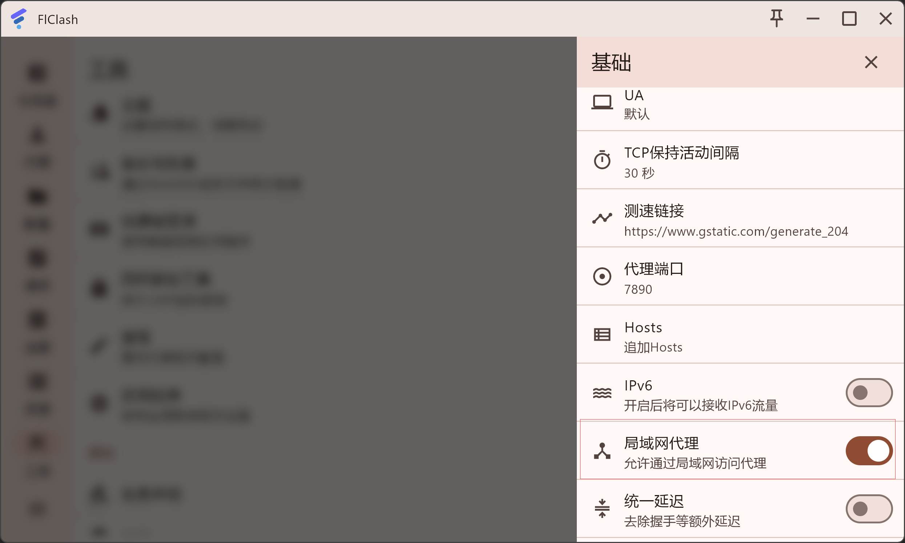

虚拟机安装proxychains4

```shell
sudo apt install proxychains4
sudo vim /etc/proxychains4.conf
```

在配置文件最后添加，局域网主机ip和代理端口

```
#......
[ProxyList]
# add proxy here ...
# meanwile
# defaults set to "tor"
#socks4         127.0.0.1 9050
socks5 192.168.137.1 7890
```

可以执行命令测试一下，ping无法使用

```shell
proxychains4 curl google.com
```

有需要可以配置在/etc/profile添加简写

```
alias px=proxychains4
```

### 1.2 下载docker

> [!error] 
>  ~~webgoat包括webwolf，一个邮件后台，可以直接安装联合版~~
>  ！！！！不可以联合版太旧了，新版webgoat变化很大，标题顺序都不一样了（）
>  新版本的webgoat和webwolf不再是两个jar包
>  直接用docker启动就ok
>  一开始没有映射wolf的端口导致以为没有wolf绕了一大圈
>补充：新版本问答选择题不知道为什么出不来，红点点不能变绿会逼死强迫症
>可以利用旧版的包来让他变绿

使用https://dockerpull.org/镜像源

```shell
#sudo proxychains4 docker pull dockerpull.org/webgoat/goatandwolf
#sudo docker run -d -p 8081:8080 -p 9091:9090 dockerpull.org/webgoat/goatandwolf
#上面是古早版本！！！用于获取新版选择题的绿点点

#前面的端口是主机端口，后面是docker的
sudo proxychains4 docker pull dockerpull.com/webgoat/webgoat
sudo docker run -d -p 8080:8080 -p 9090:9090 dockerpull.com/webgoat/webgoat
```

> https://dockerpull.org/
> 
> [Docker 搭建webgoat - lcdm123 - 博客园](https://www.cnblogs.com/lcdm123/p/13508809.html)

运行后可以点开网址，用上面的命令的话WebGoat映射到8081了

192.168.137.42是我的虚拟机ip，端口号记得打开防火墙

网址不能只写到端口号，后面的名字也要写

WebGoat http://192.168.137.42:8080/WebGoat/login

WebWolf http://192.168.137.42:9090/WebWolf/login

### 1.3 wolf使用

第一个交互ok

输入自己的用户名，发送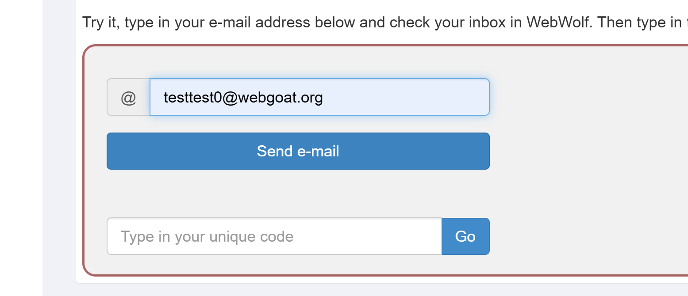

wolf里会收到邮件


> 可能的参考
> https://blog.csdn.net/elephantxiang/article/details/114608313

第二个交互不知道在干什么

点击那个修改密码页面后并没有修改，也没有受到邮件


确认后会跳转到


不太理解
新版本情况同上

### 1.4 配置BurpSuite

配置拦截过滤

Proxy>ProxySetting>


.lesson.lesson的url不属于文件

## 2 General

### 2.1 超级简单的测试

#### 2.1.1 随便试试


#### 2.1.2 POST


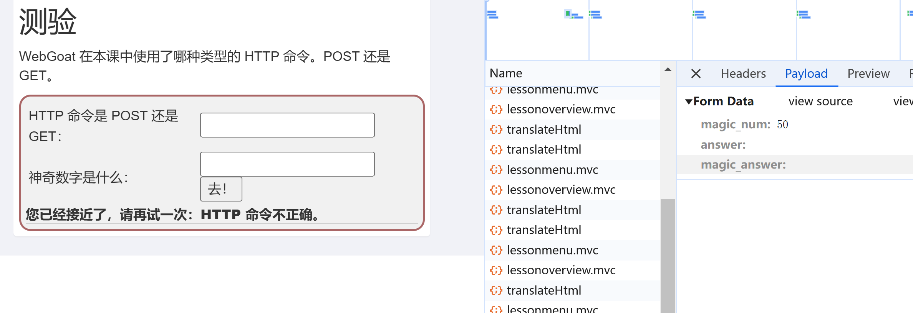

#### 2.1.3 拦截转发

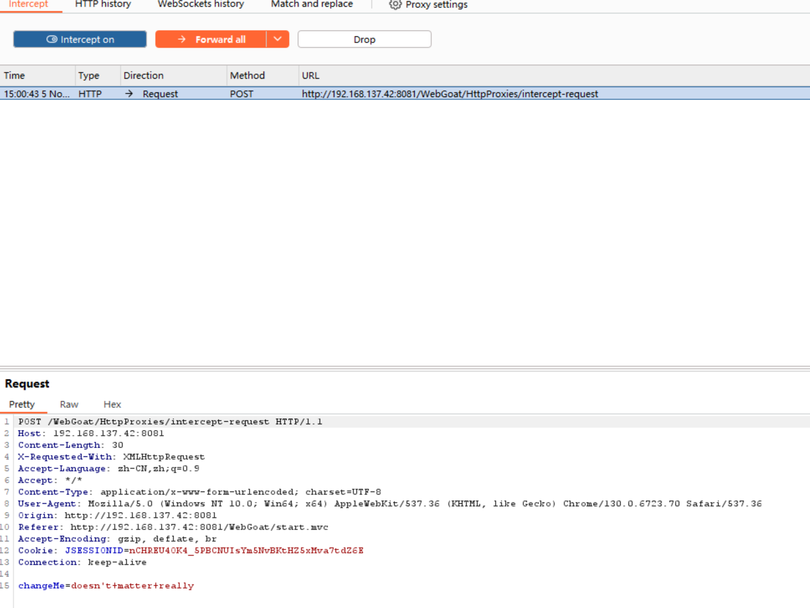

修改后转发


#### 2.1.4 控制台函数

要把之前的拦截关了

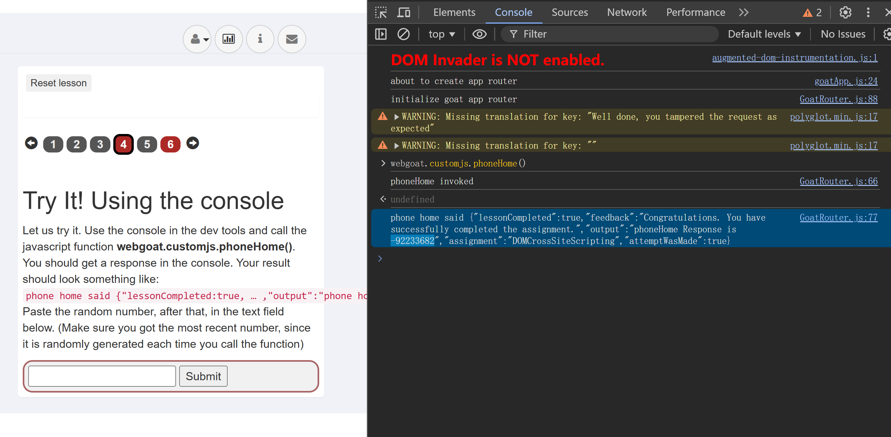

#### 2.1.5 network

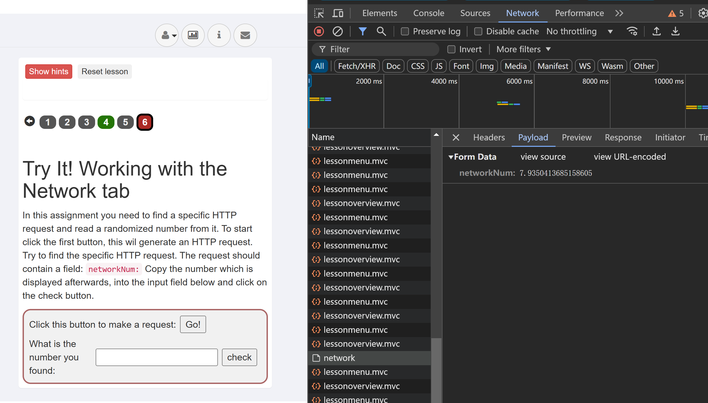

burpsuit也能看到

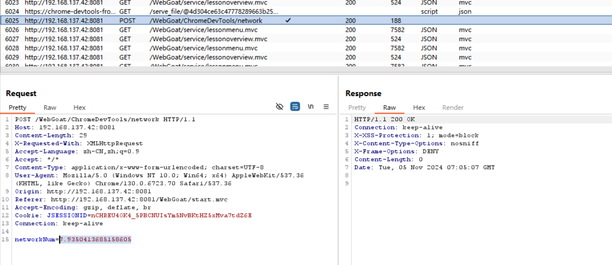

### 2.2 奇奇怪怪的
#### 2.1.6 问答题


如果没有使用有wolf联合版的docker，这里会看不到问答

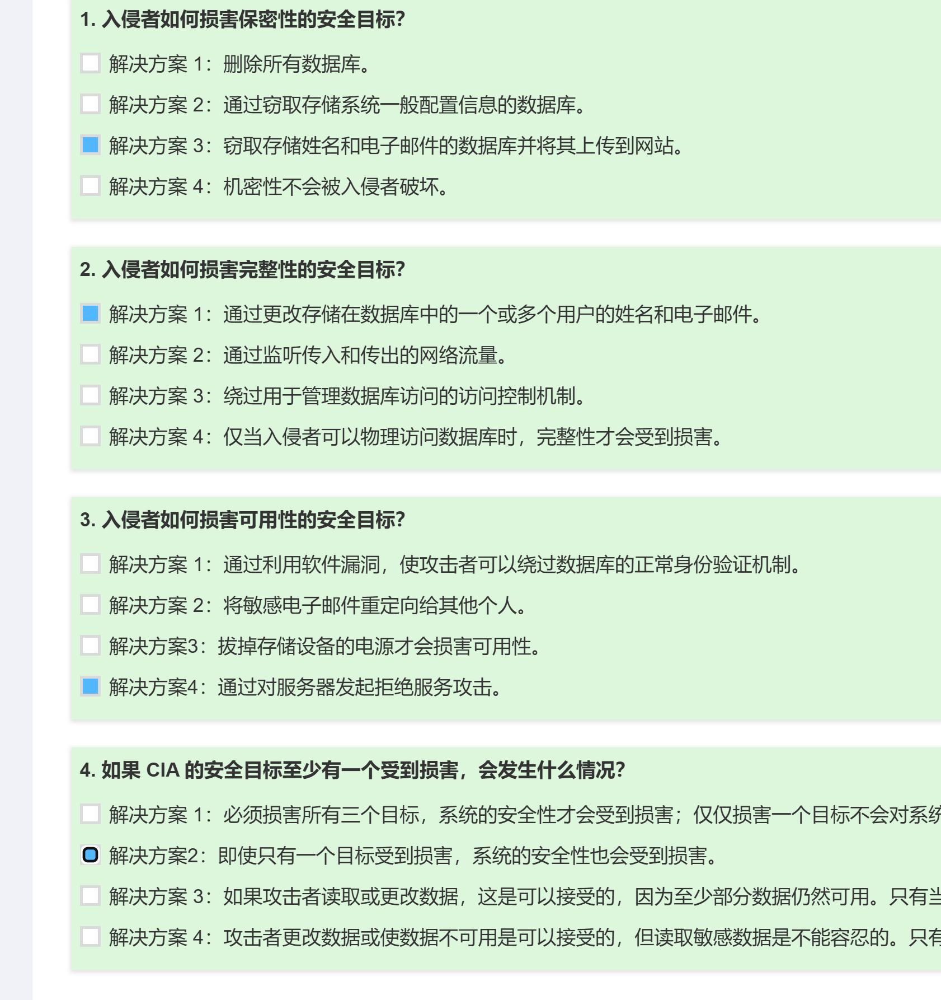

#### 绕过BUG 看不到问答题(1)

这是能打开旧版本问答的情况

> [!error] 
> 很好，新版本打不开了这个问题了
> ![[../images/Pasted image 20241112110303.png]]
> 看来一下源码
> 应该是完全在webgoat的内容，但网上什么都搜不到
> 我不理解（） 

问了一下朋友，他好像当时也是没有问答略过的
但是红点不变绿太痛苦了
利用一下旧版本试试能不能通关
旧版本抓包
![[../images/Pasted image 20241112111119.png]]

很好很粗暴，没想到POST放的是全字符串
转发，记得改右上角的地址端口
![[../images/Pasted image 20241112111808.png]]

重新搞一个正确的包用
![[../images/Pasted image 20241112112109.png]]
![[../images/Pasted image 20241112112118.png]]
OK！
#### 2.1.7 新课程的sample attack

![[../images/Pasted image 20241112110358.png]]

可以翻源码
![[../images/Pasted image 20241112110423.png]]

只要第一个参数匹配这个`secr37Value`，第二个参数随意


## 3 A2-编码加密

> [!note] 
> 在新版本这个居然变成A2了 
> ![[../images/Pasted image 20241114104425.png]]
> 等一下！好像题目不一样（）
### 3.1 base64


上面是旧版本，新版是
![[../images/Pasted image 20241114104652.png]]
![[../images/Pasted image 20241114104723.png]]

### 3.2 xor加密

这个格式一看是base64，先来一个base64解码

```shell
echo "Oz4rPj0+LDovPiwsKDAtOw==" | base64 --decode
#输出 ;>+>=>,:/>,,(0-;
```

搜了一下xor就是给每个字符与一个固定的字符异或

可以遍历一遍，看看输出有没有比较规整的


```python
def xor_decrypt(ciphertext, key):  
    return ''.join(chr(c ^ key) for c in ciphertext)  

ciphertext = [ord(c) for c in "密文字符串"]  # 将密文字符串转换为 ASCII 值  
for key in range(256):  
    decrypted = xor_decrypt(ciphertext, key)  
    print(f"Key: {key}, Decrypted: {decrypted}")
```

> 另一种
> 
> https://strelitzia.net/wasXORdecoder/wasXORdecoder.html
> 
> 

### 3.3 hash

- **MD5**：生成的哈希值长度为32个字符（128位）。
- **SHA-1**：生成的哈希值长度为40个字符（160位）。
- **SHA-256**：生成的哈希值长度为64个字符（256位）。
- **SHA-512**：生成的哈希值长度为128个字符（512位）。


看起来第一个是md5，第二个想SHA256

> 很快的网址
> 
> https://cmd5.com/

自己尝试一下！搜索到kali自带一个密码字典/usr/share/wordlists/rockyou.txt

```shell
sudo apt install wordlists
ls /usr/share/wordlists/
#rockyou.txt.gz
sudo gunzip /usr/share/wordlists/rockyou.txt.gz
```

使用hashcat

```shell
sudo apt install hashcat
```

```shell
hashcat -m 0 -a 0 5EBE2294ECD0E0F08EAB7690D2A6EE69 /usr/share/wordlists/rockyou.txt
```

| -m   |                | -a  |         |
| ---- | -------------- | --- | ------- |
| 0    | MD5            | 0   | 字典攻击    |
| 100  | SHA1           | 1   | 组合攻击    |
| 1400 | SHA256         | 3   | 暴力破解    |
| 1800 | SHA512         | 6   | 混合字典+掩码 |
| 300  | NTLM           | 7   | 混合掩码+字典 |
| 400  | SHA-256 (Unix) |     |         |
| 500  | SHA-512 (Unix) |     |         |
如果报告显示是已经查询过的密码，需要在命令后面加`--show`展示
![[../images/Pasted image 20241114105430.png]]
（这也新版本的题目答案啦~）

问了一下gpt，SHA-256 (Unix) 和 SHA256 之间的主要区别确实在于盐的使用和存储格式。

执行命令后需要等一下，这是输出的结尾

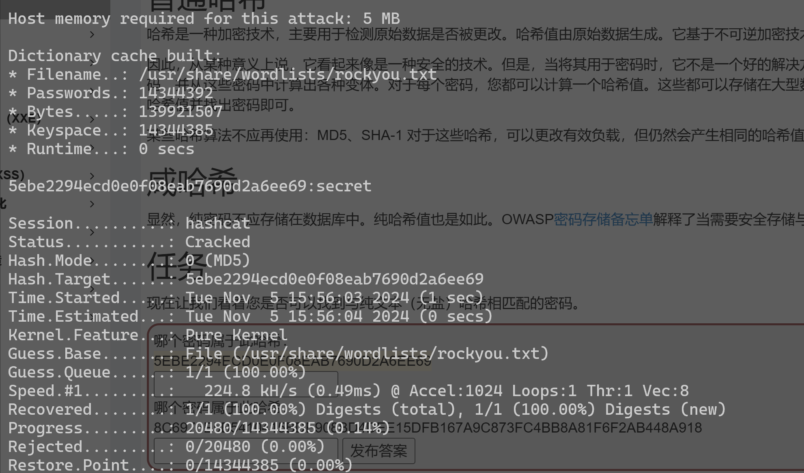

可以看到解出来是secret，解下一个

```shell
hashcat -m 1400 -a 0 8C6976E5B5410415BDE908BD4DEE15DFB167A9C873FC4BB8A81F6F2AB448A918 /usr/share/wordlists/rockyou.txt
```


也就是admin

找对了！

新版本命令

```shell
hashcat -m 0 -a 0 21232F297A57A5A743894A0E4A801FC3 /usr/share/wordlists/rockyou.txt
#21232f297a57a5a743894a0e4a801fc3:admin
hashcat -m 1400 -a 0 8D969EEF6ECAD3C29A3A629280E686CF0C3F5D5A86AFF3CA12020C923ADC6C92 /usr/share/wordlists/rockyou.t
xt
#8d969eef6ecad3c29a3a629280e686cf0c3f5d5a86aff3ca12020c923adc6c92:123456
```

### 3.4 openssl

提供了一个RSA私钥，需要我们输出模数的十六进制字符串，再将这个字符串使用私钥加密

- **直接使用二进制签名：** 如果您在系统内部使用签名（例如，进行验证或存储），可以直接使用 OpenSSL 生成的二进制签名。这种情况下，您不需要进行 Base64 编码。

- **需要传输或存储签名：** 如果您需要将签名通过文本协议（如 JSON、XML 或电子邮件）传输，或者将其存储在文本文件中，通常会将二进制签名转换为 Base64 编码。Base64 编码可以确保签名在传输过程中不会被损坏，并且可以安全地嵌入到文本格式中。

因为不是二进制文件，所以需要再Base64

将私钥原文保存在test_key.pem中

```shell
openssl rsa -in test_key.pem -modulus
```


接下来签名

```shell
echo -n "This is the string I want to sign." | openssl dgst -sha256 -sign test_key.pem | openssl base64 -A
```

openssl base64 -A可以让输出不换行


新版本密钥
![[../images/Pasted image 20241114105904.png]]
步骤同上

### 3.5 docker找密钥

首先下个它给的docker

```shell
sudo proxychains4 docker pull dockerpull.org/webgoat/assignments:findthesecret
sudo docker run -d dockerpull.org/webgoat/assignments:findthesecret
```

需要用root登录进去

```shell
sudo docker exec -it -u root <id> /bin/bash
```


```shell
echo "U2FsdGVkX199jgh5oANElFdtCxIEvdEvciLi+v+5loE+VCuy6Ii0b+5byb5DXp32RPmT02Ek1pf55ctQN+DHbwCPiVRfFQamDmbHBUpD7as=" | openssl enc -aes-256-cbc -d -a -kfile default_secret
```

解密结果`Leaving passwords in docker images is not so secure`
这题新版本一样！
## 4 简单版注入

> [!note] 
> 新版本的在A3
> 
> ![[../images/Pasted image 20241114110401.png]] 
### 4.1 SQL基础语句

> 只有写对了才能看到结果

DML命令用于对数据表的增删改查（CRUD）

```sql
select department from employees where userid=96134
```

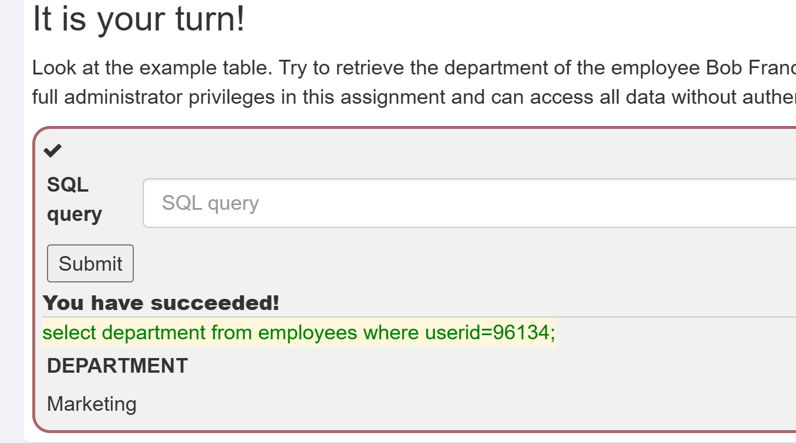

DDL命令用于操作数据库对象的结构

```sql
update employees set department='Sales' where first_name='Tobi'
```


DCL命令用于修改数据库对象使用者的访问权限

```sql
alter table employees add phone varchar(20)
```


授予用户 `unauthorized_user` 对表 `grant_rights` 的所有权限，SQL 语句：

```sql
GRANT ALL PRIVILEGES ON grant_rights TO unauthorized_user;
// 全部权限
GRANT SELECT ON grant_rights TO unauthorized_user;
// 查询权限，这个就可以过
```

不同的权限类型包括：

- `SELECT`：允许用户查询表中的数据。
- `INSERT`：允许用户向表中插入新数据。
- `UPDATE`：允许用户更新表中的现有数据。
- `DELETE`：允许用户删除表中的数据。
- `ALL PRIVILEGES`：授予用户对表的所有权限。

### 4.2 SQL注入

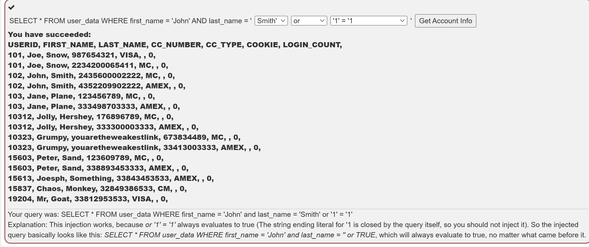

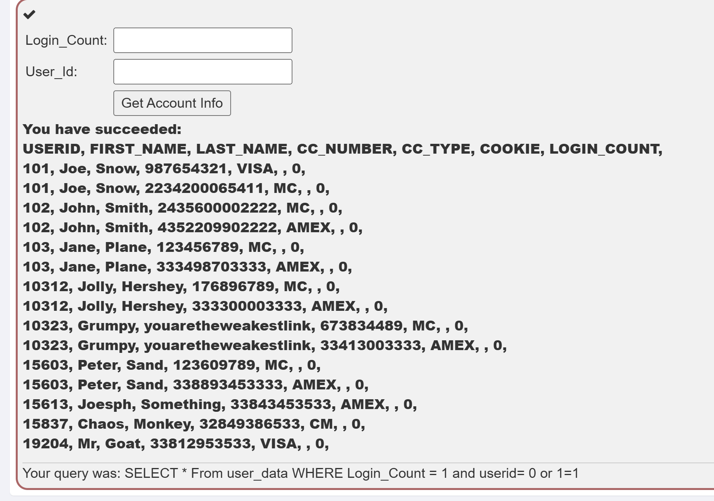

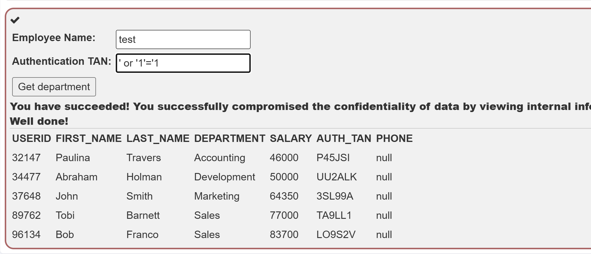

结尾添加

`;UPDATE employees SET SALARY=90000 WHERE AUTH_TAN='3SL99A`


日志这个题目好像没说怎么查，搜了一下才知道

正常使用场景，搜索全部记录，填的是last_name


增加删除语句

`*'; TRUNCATE TABLE access_log; Select * from access_log where '1'='1`

后再次查询`*`，已经没有记录了


看来只能删除表了（不合理！）
新版本还是这样（）必须删表太不合理了！

`*'; drop TABLE access_log; Select * from access_log where '1'='1`

这样才能过


### 4.4 简单路径注入

这里的题，但感觉很简单，放到这里写了
![[../images/Pasted image 20241111161846.png]]

![[../images/Pasted image 20241111161920.png]]
随便上传一个文件，告诉我上传到这里了
于是可以上传到上一级目录
![[../images/Pasted image 20241111155420.png]]
以为test是文件夹，其实是test文件那就直接文件名咯
![[../images/Pasted image 20241111155609.png]]
上传到`../test`，test可以替换成任意文件名

下一题说删除了`../`
测试一下`../`，发现路径显示的就是删去这段的内容，试试双写就过了，`....//test`
![[../images/Pasted image 20241111160043.png]]

### 3.4 抓包的路径注入

![[../images/Pasted image 20241111161939.png]]
上传的路径直接就是我的文件名
抓个包
![[../images/Pasted image 20241111160730.png]]
很朴素，一个包就包括了我的文件内容，直接再发一次，得到同样的结果
那就把名字改成`../info.txt`，OK

下一题是猫猫图片
抓个包，发现那个`Location: /PathTraversal/random-picture?id=1.jpg`
![[../images/Pasted image 20241111161658.png]]
感觉有用
拿来自己当参数用一下，发现回显是两个jpg，看来会自动加后缀
![[../images/Pasted image 20241111162101.png]]

去掉后缀试一下，拿到指定图片了
![[../images/Pasted image 20241111162155.png]]

../会报`Illegal characters are not allowed in the query params`
把../完全改为url编码可以绕过
> [!note] 
> 转换参考：
> ![[../images/Pasted image 20241111163544.png]] 

可以利用报错的输出列表找目标图片
![[../images/Pasted image 20241111163431.png]]
在上两级的目录里
![[../images/Pasted image 20241111163656.png]]

> [!warning] 
> 这里可能有一个检查
> 不完整的字符串就搜的到
> ![[../images/Pasted image 20241111164014.png]] 
> 完整的字符串直接返回了bad
> ![[../images/Pasted image 20241111164104.png]]
> 一开始被骗了（）以为id只能输入数字

![[../images/Pasted image 20241111164214.png]]

去kali上跑一下命令

```shell
echo -n "testtest0" | sha512sum
```

### 3.5 zip的路径注入

随便压缩一个zip就说我完成了？？？
![[../images/Pasted image 20241111165304.png]]

思考了一下可能是我之前就是这个文件，它直接给我替换了？
目录是这里，我换个名字压缩看看
![[../images/Pasted image 20241111165546.png]]

又是直接替换了，不同名字为什么会替换
![[../images/Pasted image 20241111165716.png]]

> [!important] 
>  找到了
>  https://github.com/WebGoat/WebGoat/issues/1103 
>  这里有一个2023年的更新，我使用和wolf联合版的不是最新的！！！
>  ![[../images/Pasted image 20241111173946.png]]
>  

竟然有这么多变化xxxxxxx震惊！有点离谱我要重写了bushi
![[../images/Pasted image 20241111174036.png]]

新版本！

其实就是构造一个路径的zip，下一篇就可以直接用

探索一下，上传的profile.zip其实在这里，这确实很难从路径慢慢找的
![[../images/Pasted image 20241121162436.png]]

也就是zip只需要 `../../home/webgoat/.webgoat-2023.8/PathTraversal/testtest/testtest.jpg` 就可以了
题目中为了准确进行了好几次../，不过感觉差不多就不重新试了
必须替换testtest.jpg才行


---

这篇就到这里吧，下一篇再继续写  
## @PHOEXINA
